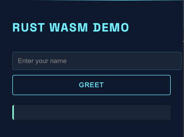
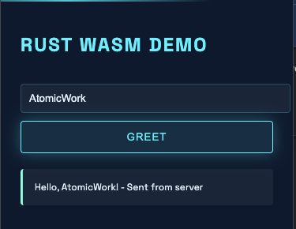

# WebSocket Chrome Extension

This Chrome extension demonstrates WebSocket communication between a browser extension and a local server.

## Setup Instructions

### 1. Start the WebSocket Server

1. Navigate to the server directory
2. Install dependencies:
   ```bash
   npm install
   ```
3. Start the server:
   ```bash
   node server.js
   ```
   The WebSocket server will start running on `ws://localhost:8080`

### 2. Load the Chrome Extension

1. Open Chrome and go to `chrome://extensions/`
2. Enable "Developer mode" in the top right corner
3. Click "Load unpacked"
4. Select the `extension` directory from this project
5. The extension icon should appear in your Chrome toolbar

## Usage

- Click the extension icon to open the popup
- The extension will automatically attempt to connect to the WebSocket server
- The connection status will be displayed in the popup
- Messages received from the server will be shown in the popup

## Development

- The main extension code is in `popup.js`
- The WebSocket server implementation is in `background.js`
- Modify these files to customize the WebSocket communication

## Screenshots




## Troubleshooting

- Make sure the WebSocket server is running before using the extension
- Check the Chrome DevTools console for any error messages
- Verify that the WebSocket connection URL matches your server configuration
# rust-ws-extension
